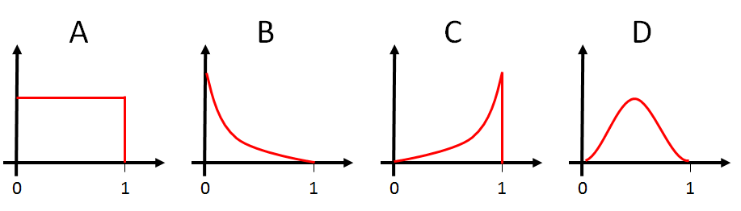

# TRISEP 2022 Statistics Sessions
Dean Karlen, University of Victoria and TRIUMF

### [Reference notes and apps](https://particle.phys.uvic.ca/~karlen/trisep2022/)

## Tutorial notebooks

["Scratch" notebook for rough calculations](notebooks/scratch.ipynb)

### 1. Radioactivity Analyses

 - A: [Basic analysis](notebooks/radioactivity_A.ipynb)
   - descriptive statistics
   - approximate interval
 - B: [Model the experiment](notebooks/radioactivity_B.ipynb)
   - maximum likelihood
   - approaximate interval
 - C: [Frequentist analysis with 1 parameter](notebooks/radioactivity_C.ipynb)
   - Rigorous definition of confidence interval
 - D: [Bayesian analysis with 1 parameter](notebooks/radioactivity_D.ipynb)
   - making a credible interval
 - E: [Including background in the model](notebooks/radioactivity_E.ipynb)
   - likelihood function with 2 parameters
   - difficulty with frequentist approach
 - F: [Bayesian analysis of experiment with background](notebooks/radioactivity_F.ipynb)
   - Markov Chain Monte Carlo
 - G: [Including inefficiency and background in the model](notebooks/radioactivity_G.ipynb)
   - MCMC
   - Numerical optimization with MINUIT
   
 ### 2. Lifetime Analyses
 
 - A: [Basic analysis](notebooks/lifetime_A.ipynb)
   - descriptive statistics
 - B: [Model the lifetime experiment (perfect setup)](notebooks/radioactivity_B.ipynb)
   - rigorous confidence interval
 - C: [Include more complexity to the model](notebooks/radioactivity_B.ipynb)
   - includes: background process, time offset, and time resolution
   
 ### 3. T2K $\nu_e$ appearance analysis
 
 - A: [Simplified analysis](notebooks/nueT2K.ipynb)
   - MCMC treatment
   - Effect of changing prior for physics parameter
   
## Image for challenge problem on p-value distributions

